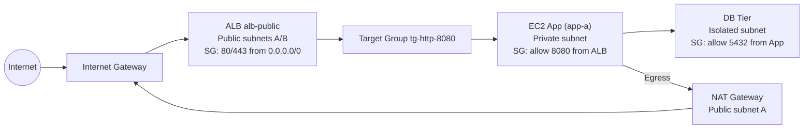

---

# Secure 3-Tier VPC (Console-Only) – Week 1 Lab

**Goal:** Build a production-style VPC with a public **ALB** tier, private **App** tier (via **NAT**), and an **isolated DB** tier — security by default.

---

## What I built (Phase 0–1)

* **S3 lab bucket** with:

  * Versioning enabled
  * Default encryption (SSE-S3)
  * Block Public Access = ON

* **VPC 10.0.0.0/16** across **2 Availability Zones**:

  * **Public subnets:** `10.0.0.0/24 (a)`, `10.0.1.0/24 (b)` — auto-assign public IP = **ON**
  * **App subnets (private):** `10.0.10.0/24 (a)`, `10.0.11.0/24 (b)`
  * **DB subnets (isolated):** `10.0.20.0/24 (a)`, `10.0.21.0/24 (b)`

* **Networking:**

  * **Internet Gateway (IGW)** attached
  * **NAT Gateway** in a public subnet (with Elastic IP)

* **Routing:**

  * **rt-public** → `0.0.0.0/0 → IGW` (public subnets)
  * **rt-app** → `0.0.0.0/0 → NAT` (app subnets)
  * **rt-db** → local only (db subnets)

* VPC DNS **resolution + hostnames enabled**

---

## What I built (Phase 2)

* **Security Groups** (least privilege, tiered trust):

  * `alb-public-sg`: allow **80/443 from Internet**, forward only to app tier
  * `app-private-sg`: allow **8080 from alb-public-sg**
  * `db-isolated-sg`: allow **5432 from app-private-sg**

* **EC2 App instance (`app-a`):**

  * Launched in private subnet (no public IP)
  * User Data bootstraps simple Python app (`app.py`) on port **8080**
  * Managed via **systemd** (auto-start + restart on failure)

* **Target Group (`tg-http-8080`):**

  * Protocol: HTTP, Port 8080
  * Health checks on `/`
  * Registered `app-a` as target

* **Application Load Balancer (`alb-public`):**

  * Internet-facing, across **2 AZs** for HA
  * Listener: **HTTP :80** → forwards to target group
  * Public DNS (auto-assigned by AWS) serves:

    ```txt
    OK – Secure 3-Tier App
    ```

---

## Why this design

* **Least exposure** → only ALB is internet-facing; App + DB have no public IPs
* **SG chaining** → ALB → App (8080) → DB (5432) → enforces strict trust boundaries
* **HA-ready** → subnets in multiple AZs for redundancy
* **Security-first** → encryption, isolation, and minimal entry points
* **Production-style** → mirrors how real 3-tier apps run in AWS

---

## Architecture (Mermaid)


